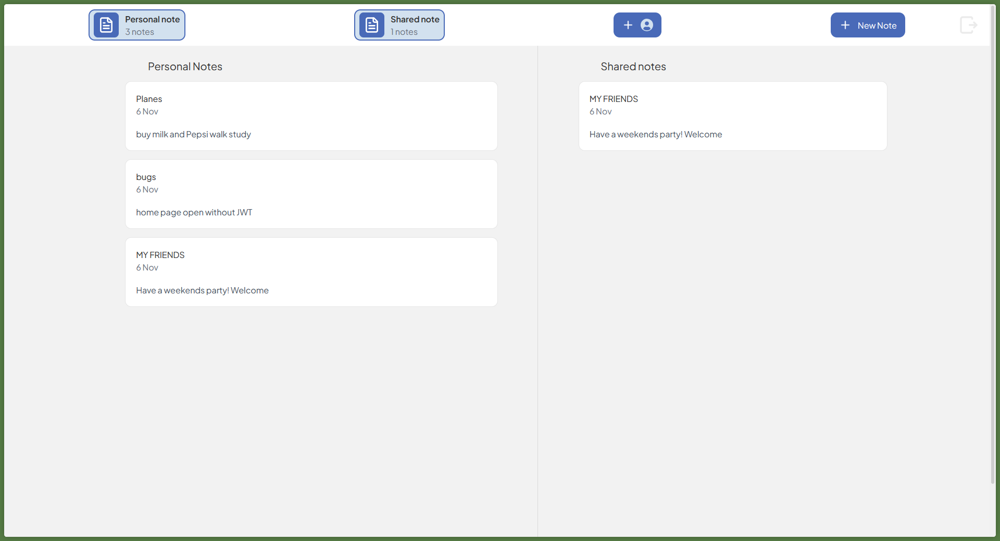
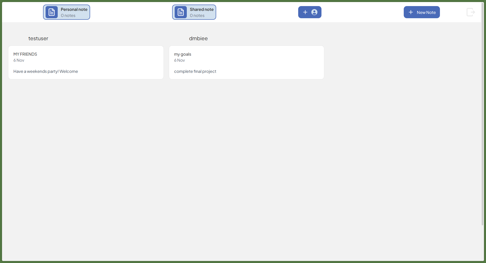
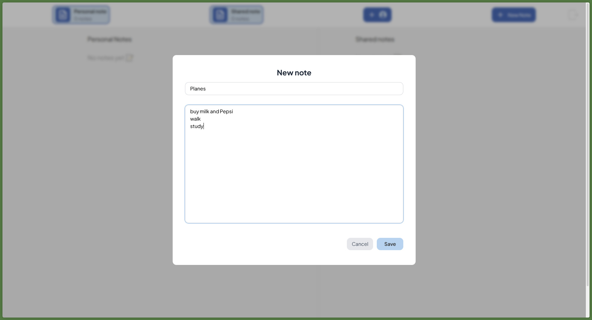
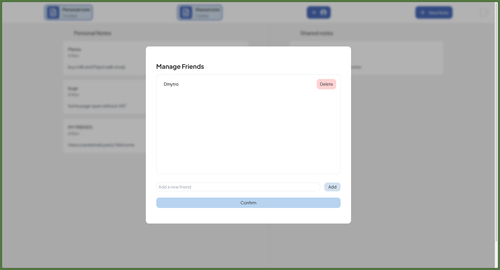
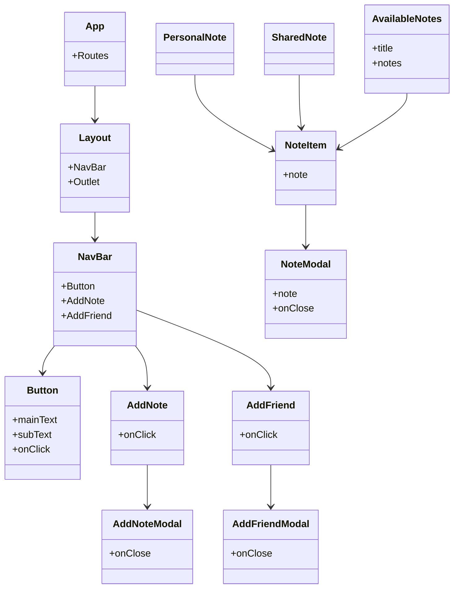

# Secure Note App

> **A convenient and secure app for storing personal and shared notes with friend management.**

## 📦 Features

- Create, edit, and delete notes
- Share notes with friends
- Manage your friends list
- User authentication (register, login, logout)
- Modern interface built with React + TailwindCSS

## 🛠️ Technologies

- **React** (TypeScript)
- **TailwindCSS**
- **React Query** for API handling
- **Framer Motion** for modal animations
- **Vite** for fast development
- **Node.js** 

## 🚀 Getting Started

1. Clone the repository:
   ```sh
   git clone https://github.com/dmbiee/secure-note-app-front.git
   cd secure-note-app-front
   ```

2. Install dependencies:
   ```sh
   npm install
   ```

3. Start the app:
   ```sh
   npm run dev
   ```

4. Make sure the backend server is running at `localhost:8080` (see backend repository).

## 🖼️ Screenshots

> Add screenshots of the interface for better overview.






## 🧩 Project Structure

```
src/
  ├── api/              # Backend API requests
  ├── assets/           # Types, static data
  ├── components/       # UI components
  ├── hooks/            # Custom hooks
  ├── pages/            # Pages
  ├── App.tsx           # Main component
  └── main.tsx          # Entry point
```

## 🗂️ Main Components

- **NavBar** — main navigation
- **PersonalNote** — personal notes
- **SharedNote** — notes shared with you
- **AddNoteModal** — modal for creating a note
- **AddFriendModal** — modal for adding a friend
- **NoteItem** — note card
- **NoteModal** — note details view

## 📋 Component Diagram



## 👤 Author

- [dmbiee](https://github.com/dmbiee)

---

> _Created for an educational project. All rights reserved._
