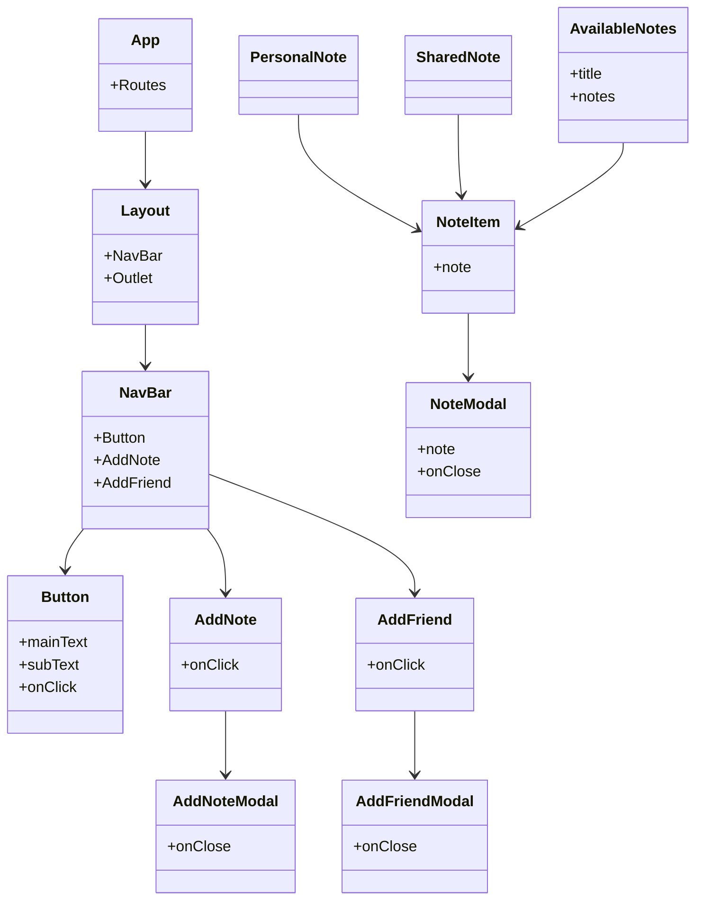

# Secure Note App

## React Components Class Diagram

```mermaid
classDiagram
    class App {
        +Routes
    }
    class Layout {
        +NavBar
        +Outlet
    }
    class NavBar {
        +Button
        +AddNote
        +AddFriend
    }
    class Button {
        +mainText
        +subText
        +onClick
    }
    class AddNote {
        +onClick
    }
    class AddFriend {
        +onClick
    }
    class AddNoteModal {
        +onClose
    }
    class AddFriendModal {
        +onClose
    }
    class NoteItem {
        +note
    }
    class NoteModal {
        +note
        +onClose
    }
    class PersonalNote
    class SharedNote
    class AvailableNotes {
        +title
        +notes
    }
    App --> Layout
    Layout --> NavBar
    NavBar --> Button
    NavBar --> AddNote
    NavBar --> AddFriend
    AddNote --> AddNoteModal
    AddFriend --> AddFriendModal
    PersonalNote --> NoteItem
    SharedNote --> NoteItem
    AvailableNotes --> NoteItem
    NoteItem --> NoteModal
```
